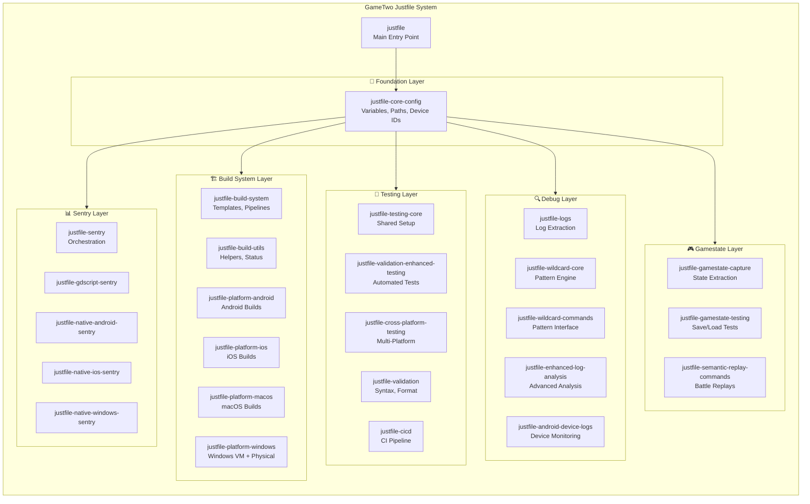
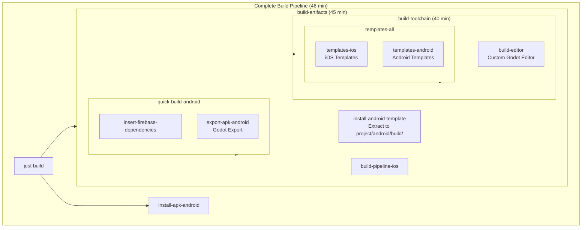
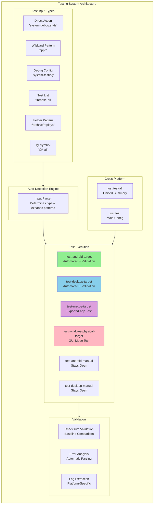
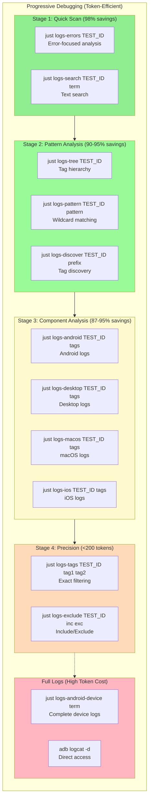
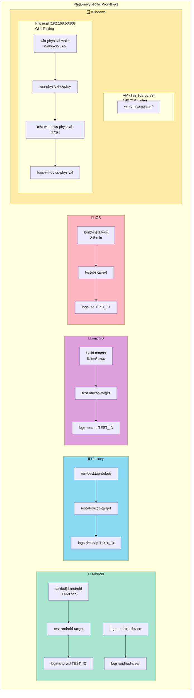
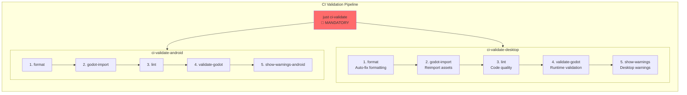
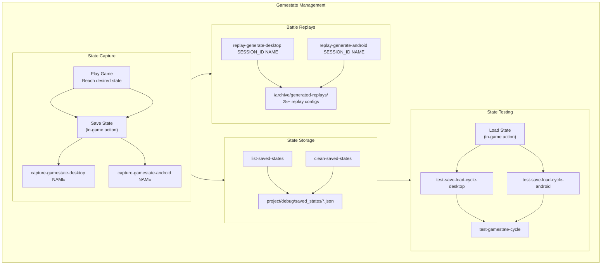
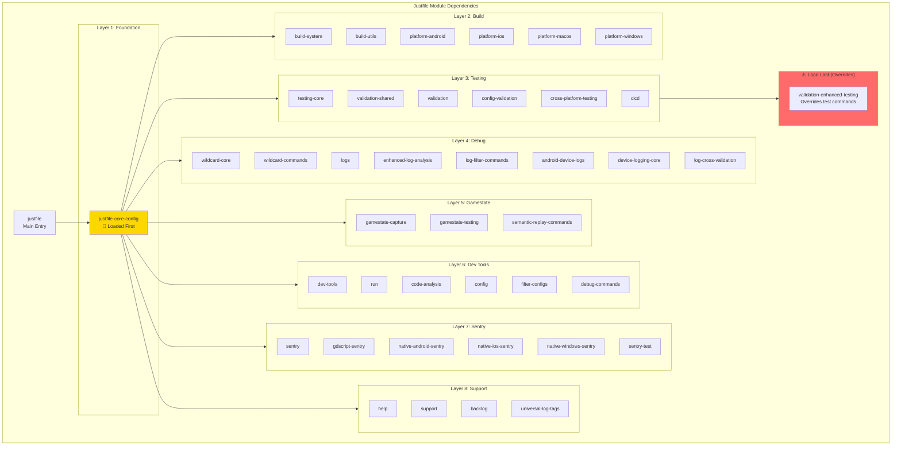
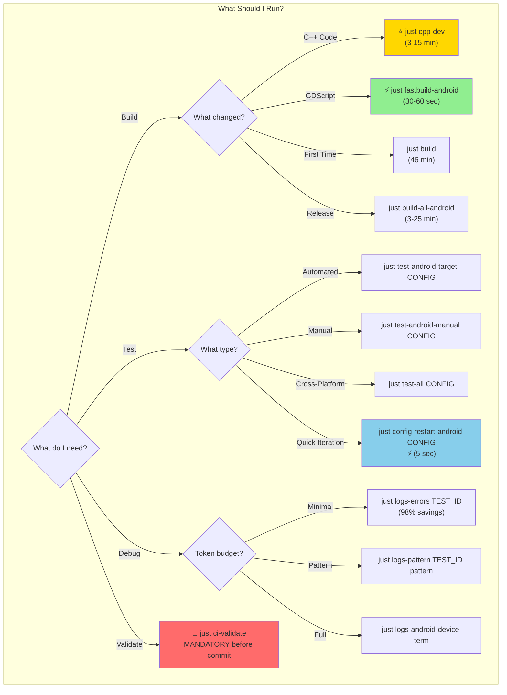

# Justfile Build and Test System Architecture

Comprehensive visual documentation of GameTwo's justfile-based build and test infrastructure.

**Purpose**: Help developers understand system relationships and assist Claude Code in reasoning about the build/test system.

---

## 📋 System Overview

---

## 🏗️ Build System Hierarchy

---

## ⚡ Android Build Pathways

```mermaid
flowchart LR
    subgraph "Android Build Options"
        direction TB
        
        subgraph FULL["🏗️ Full Pipeline (3-25 min)"]
            FULL_CMD["just build-all-android"]
            FULL_TEMP["build-android-templates<br/>SCons → Gradle .aar"]
            FULL_FB["insert-firebase-dependencies"]
            FULL_APK["export-apk-android"]
            FULL_AAB["export-aab-android"]
            
            FULL_CMD --> FULL_TEMP --> FULL_FB --> FULL_APK --> FULL_AAB
        end
        
        subgraph QUICK["🚀 Quick Build (2-3 min)"]
            QUICK_CMD["just quick-build-android"]
            QUICK_FB["insert-firebase-dependencies"]
            QUICK_EXP["export-apk-android"]
            
            QUICK_CMD --> QUICK_FB --> QUICK_EXP
        end
        
        subgraph FAST["⚡ Fast Build (30-60 sec)"]
            FAST_CMD["just fastbuild-android"]
            FAST_EXP["Godot export to /tmp/"]
            FAST_FB["insert-firebase-dependencies"]
            FAST_GRADLE["Gradle assembleStandardDebug"]
            FAST_INST["adb install"]
            FAST_LAUNCH["launch-android"]
            
            FAST_CMD --> FAST_EXP --> FAST_FB --> FAST_GRADLE --> FAST_INST --> FAST_LAUNCH
        end
        
        subgraph CPP["⭐ C++ Dev Workflow"]
            CPP_CMD["just cpp-dev"]
            CPP_TEMP["build-android-templates"]
            CPP_INST["install-android-template"]
            CPP_FAST["fastbuild-android"]
            
            CPP_CMD --> CPP_TEMP --> CPP_INST --> CPP_FAST
        end
    end
    
    style FAST fill:#90EE90
    style CPP fill:#FFD700
```

---

## 🧪 Testing Infrastructure

---

## 🔍 Debug & Log Analysis Flow

---

## 🌐 Multi-Platform Architecture

---

## 🔄 CI/CD Validation Pipeline

---

## 🎮 Gamestate & Replay System

---

## 📦 Module Dependency Graph

---

## 🎯 Quick Decision Guide

---

## 📊 Module Count Summary

| Layer | Module Count | Purpose |
|-------|--------------|---------|
| Foundation | 1 | Core configuration, paths, variables |
| Build System | 6 | Template generation, platform builds |
| Testing | 6 | Test execution, validation, CI/CD |
| Debug/Logs | 9 | Log analysis, pattern matching, device monitoring |
| Gamestate | 3 | State capture, replay, testing |
| Dev Tools | 6 | Running, config, code analysis |
| Sentry | 6 | Crash reporting integration |
| Support | 4 | Help, backlog, tags |
| **Total** | **41+** | **22,000+ lines of infrastructure** |

---

## 🚨 Critical Rules Summary

1. **`just fastbuild-android`** - MANDATORY after ANY code changes before Android testing
2. **`just ci-validate`** - MANDATORY before commits
3. **`just cpp-dev`** - Recommended one-command C++ workflow
4. Use `test-*` commands (NOT `run-*`) for debug actions
5. Start debugging with `logs-errors` (98% token savings)
6. Cross-platform testing uses `test-all` for unified summary

---

*Generated for GameTwo development. Use this diagram to understand system relationships and choose the right commands.*
