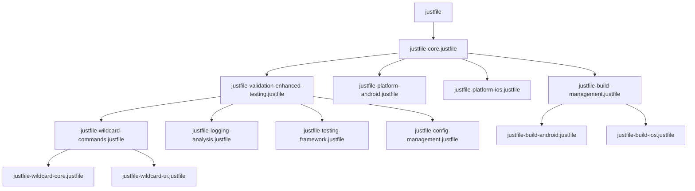

# task-096 - Create justfile dependency graph visualization

## Context

**Priority**: 🔥 HIGH  
**Status**: Open  
**Estimated Effort**: 2-3 days  
**Category**: DevOps - Architecture Documentation  

## Problem Statement

The GameTwo project has evolved into a sophisticated 29-module justfile system (14,088 lines) with complex interdependencies. The current architecture has **647 internal just calls** creating high coupling and potential circular dependency risks that could cause cascade failures.

**Critical Issues**:
- No visibility into module dependency relationships
- Risk of circular dependencies causing infinite loops
- Difficult to understand impact of changes across modules
- Maintenance burden due to hidden coupling
- Bus factor risk with complex interdependencies

## Technical Goals

### Primary Objectives
1. **Dependency Visualization**: Create comprehensive dependency graph of all 29 justfile modules
2. **Circular Dependency Detection**: Identify and document any circular import risks
3. **Impact Analysis**: Show which modules are affected by changes to other modules
4. **Architecture Documentation**: Provide visual guide for developers

### Success Criteria
- [ ] Complete dependency graph showing all 29 modules and their relationships
- [ ] Automated circular dependency detection with alerts
- [ ] Visual impact analysis for change management
- [ ] Integration with existing documentation system
- [ ] Maintainable visualization that updates automatically

## Implementation Approach

### Phase 1: Dependency Extraction
```bash
# Create dependency analysis script
analyze-justfile-dependencies:
    #!/usr/bin/env bash
    echo "🔍 Analyzing justfile dependencies..."
    
    # Extract import statements from all justfiles
    find justfiles/ -name "*.justfile" | while read file; do
        module_name=$(basename "$file" .justfile)
        echo "Analyzing: $module_name"
        
        # Find import statements and just calls
        grep -n "^import" "$file" | while read line; do
            imported_module=$(echo "$line" | sed 's/.*import[[:space:]]*"\([^"]*\)".*/\1/')
            echo "$module_name -> $imported_module (import)"
        done
        
        # Find internal just calls
        grep -n "just [a-zA-Z]" "$file" | while read line; do
            called_command=$(echo "$line" | sed 's/.*just[[:space:]]*\([a-zA-Z-]*\).*/\1/')
            echo "$module_name -> $called_command (call)"
        done
    done > /tmp/justfile_dependencies.txt
```

### Phase 2: Graph Generation
```bash
# Generate mermaid diagram
generate-dependency-graph:
    #!/usr/bin/env bash
    echo "📊 Generating dependency graph..."
    
    cat > docs/justfile-architecture.md << 'EOF'
# GameTwo Justfile Architecture
    
## Module Dependency Graph
    

EOF
```

### Phase 3: Automated Analysis
```bash
# Circular dependency detection
detect-circular-dependencies:
    #!/usr/bin/env bash
    echo "🔄 Detecting circular dependencies..."
    
    # Use topological sort to detect cycles
    python3 << 'EOF'
import sys
from collections import defaultdict, deque

def detect_cycles(dependencies):
    graph = defaultdict(list)
    in_degree = defaultdict(int)
    
    # Build graph
    for dep in dependencies:
        parts = dep.split(' -> ')
        if len(parts) == 2:
            from_mod, to_mod = parts[0], parts[1].split(' ')[0]
            graph[from_mod].append(to_mod)
            in_degree[to_mod] += 1
            if from_mod not in in_degree:
                in_degree[from_mod] = 0
    
    # Topological sort
    queue = deque([node for node in in_degree if in_degree[node] == 0])
    processed = 0
    
    while queue:
        node = queue.popleft()
        processed += 1
        
        for neighbor in graph[node]:
            in_degree[neighbor] -= 1
            if in_degree[neighbor] == 0:
                queue.append(neighbor)
    
    if processed != len(in_degree):
        print("🚨 CIRCULAR DEPENDENCIES DETECTED!")
        return False
    else:
        print("✅ No circular dependencies found")
        return True

# Read dependencies and check for cycles
with open('/tmp/justfile_dependencies.txt', 'r') as f:
    dependencies = f.readlines()

detect_cycles(dependencies)
EOF
```

## Dependencies

- **Depends on**: Existing 29 justfile modules
- **Integrates with**: Documentation system (CLAUDE.md)
- **Enhances**: Developer onboarding and maintenance
- **Supports**: Future justfile refactoring efforts

## Implementation Details

### Visualization Components

1. **Module Hierarchy Diagram**:
   ```mermaid
   graph TD
       Core[Core System] --> Validation[Validation & Testing]
       Core --> Platform[Platform Support]
       Core --> Build[Build Management]
       Validation --> Wildcard[Wildcard System]
       Validation --> Logging[Logging Analysis]
   ```

2. **Dependency Metrics Dashboard**:
   ```bash
   # Generate dependency statistics
   dependency-stats:
       echo "📊 Justfile Dependency Statistics"
       echo "================================="
       echo "Total Modules: $(find justfiles/ -name "*.justfile" | wc -l)"
       echo "Total Import Statements: $(grep -r "^import" justfiles/ | wc -l)"
       echo "Total Internal Calls: $(grep -r "just [a-zA-Z]" justfiles/ | wc -l)"
       echo "Most Coupled Module: $(analyze-coupling --top-1)"
       echo "Circular Dependencies: $(detect-circular-dependencies --count)"
   ```

3. **Impact Analysis Tool**:
   ```bash
   # Show impact of changing a specific module
   analyze-impact MODULE_NAME:
       echo "🔄 Impact analysis for {{MODULE_NAME}}"
       echo "Modules that depend on {{MODULE_NAME}}:"
       grep -r "{{MODULE_NAME}}" justfiles/ --include="*.justfile"
       echo ""
       echo "Commands that {{MODULE_NAME}} depends on:"
       grep "just [a-zA-Z]" "justfiles/{{MODULE_NAME}}.justfile"
   ```

### Risk Assessment Matrix

| Risk Level | Criteria | Action Required |
|------------|----------|-----------------|
| 🟢 LOW | <5 dependencies | Monitor |
| 🟡 MEDIUM | 5-10 dependencies | Review architecture |
| 🟠 HIGH | 10-20 dependencies | Plan refactoring |
| 🔴 CRITICAL | >20 dependencies | Immediate action |

## Risk Mitigation

### Technical Risks
- **Complexity Growth**: Graph becomes unreadable with scale
  - *Mitigation*: Hierarchical visualization with drill-down capability
- **Maintenance Overhead**: Graph becomes outdated
  - *Mitigation*: Automated generation integrated into CI/CD
- **Performance Impact**: Analysis takes too long
  - *Mitigation*: Efficient parsing with caching

### Process Risks
- **Developer Adoption**: Complex visualization ignored by team
  - *Mitigation*: Simple, actionable visualization with clear benefits
- **Documentation Sync**: Graph doesn't match reality
  - *Mitigation*: Automated validation and regeneration

## Acceptance Criteria

### Must Have
- [ ] Complete visual dependency graph of all 29 justfile modules
- [ ] Automated circular dependency detection with clear error messages
- [ ] Integration with `just help` system for easy access
- [ ] Documentation explaining how to interpret and use the graph
- [ ] Automated regeneration when modules change

### Should Have
- [ ] Interactive HTML version with clickable nodes
- [ ] Dependency metrics and statistics dashboard
- [ ] Impact analysis tool for change management
- [ ] Risk assessment with coupling metrics

### Nice to Have
- [ ] Historical dependency evolution tracking
- [ ] Refactoring recommendations based on coupling analysis
- [ ] Integration with code review process
- [ ] Visual diff showing dependency changes in PRs

## Implementation Notes

**Integration with Existing Systems**:
```bash
# Add to main justfile
help-architecture:
    echo "📊 GameTwo Architecture Documentation"
    echo "===================================="
    echo ""
    echo "🔍 Dependency Analysis:"
    echo "  just analyze-justfile-dependencies  # Full dependency analysis"
    echo "  just detect-circular-dependencies   # Check for circular deps"
    echo "  just generate-dependency-graph      # Generate visual graph"
    echo ""
    echo "📈 Architecture Metrics:"
    echo "  just dependency-stats               # Show coupling statistics"
    echo "  just analyze-impact MODULE_NAME     # Impact analysis"
    echo ""
    echo "📖 Documentation:"
    echo "  docs/justfile-architecture.md       # Complete architecture guide"
```

**Success Metrics**:
- 100% visibility into all module dependencies
- Zero undetected circular dependencies
- 50% reduction in time required to understand justfile architecture
- 90% developer satisfaction with dependency documentation

This task addresses the critical need for understanding and managing the complex justfile architecture that has evolved in GameTwo, providing essential visibility for future maintenance and development.